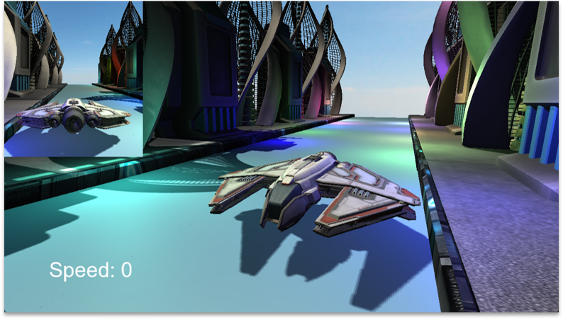

# StrikeEngine

A C++17 game engine built on OpenGL 4.3, featuring an XML-driven scene system, ECS architecture, physics simulation, and spatial audio. StrikeEngine is an learning and research project. 

---

## Features

- **XML Scene System** - Define your entire scene in a single `.xml` file: entities, components, assets, lighting, fog, and skybox
- **C++ Scripting** - similiar to Unity

- **Clustered Forward Rendering** - OpenGL 3D world rendering - shader implementation based on [Dave H's clustered shading tutorial](https://github.com/DaveH355/clustered-shading) for building clusteres
- **Font Rendering** - UI text via FreeType
- **Entity Component System** - Powered vie EnTT
- **Physics Simulation** - Rigid body dynamics and collision detection via Bullet3
- **3D Audio** - Spatial audio with distance attenuation via miniaudio
- **Model Loading** - OBJ, FBX, and GLTF support via Assimp
- **Event System** - Keyboard, mouse, and window events with polling

---

## Rendered Scene

## Inspirations

StrikeEngine's architecture and API design were inspired by:

- **[PlayCanvas](https://playcanvas.com)** - Entity hierarchy management
- **[Unity](https://unity.com)** - Component-based entity model, script lifecycle (`onCreate`, `onStart`, `onUpdate`, `onDestroy`)
- **[Hazel](https://github.com/TheCherno/Hazel)** - Application lifecycle, event system design, and logging architecture, based on the [Hazel game engine tutorial series](https://www.youtube.com/playlist?list=PLlrATfBNZ98dC-V-N3m0Go4deliWHPFwT) by [TheCherno](https://github.com/TheCherno)

---

## Documentation (Work in Progress)

| # | Topic | Description |
|---|---|---|
| 01 | [Getting Started](docs/01-getting-started.md) | Build setup, CMake configuration, project structure |
| 02 | [Scene Format](docs/02-scene-format.md) | XML scene reference: assets, entities, components |
| 03 | [Template Format](docs/03-template-format.md) | Prefab/template XML format and instantiation |
| 04 | [Script API](docs/04-script-api.md) | Script lifecycle, `REGISTER_SCRIPT`, LogicComponent |
| 05 | [Entity API](docs/05-entity-api.md) | Entity creation, hierarchy, transform methods |
| 06 | [Components API](docs/06-components-api.md) | All built-in components and their properties |
| 07 | [AssetManager API](docs/07-assetManager-api.md) | Loading, retrieving, and managing assets |
| 08 | [Asset API](docs/08-asset-api.md) | Model, Texture, CubeMap, Audio, Template asset classes |
| 09 | [World API](docs/09-world-api.md) | Scene loading, raycasting, gravity, fog |
| 10 | [Scene API](docs/10-scene-api.md) | Entity management, ECS access, skybox, sun |
| 11 | [Sun API](docs/11-sun-api.md) | Directional light, rotation, shadows, day/night cycle |
| 12 | [Application API](docs/12-application-api.md) | Application lifecycle, window, FPS control, master volume |
| 13 | [Event API](docs/13-event-api.md) | Event types, dispatcher, script event handling, key codes |
| 14 | [Input API](docs/14-input-api.md) | Polling-based keyboard, mouse, and cursor control |
| 15 | [GameData API](docs/15-gameData-api.md) | Persistent key-value game data storage |
| 16 | [Utilities](docs/16-utilities.md) | Logging macros, ComponentRegistry, ScriptRegistry |

---

## Dependencies

All dependencies are vendored and built automatically - no separate installs required.

GLFW · Glad · GLM · Assimp · stb_image · FreeType · Bullet3 · miniaudio · EnTT · spdlog · pugixml